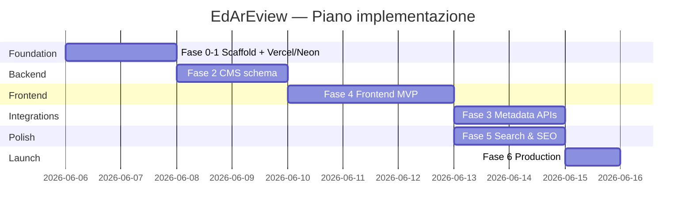
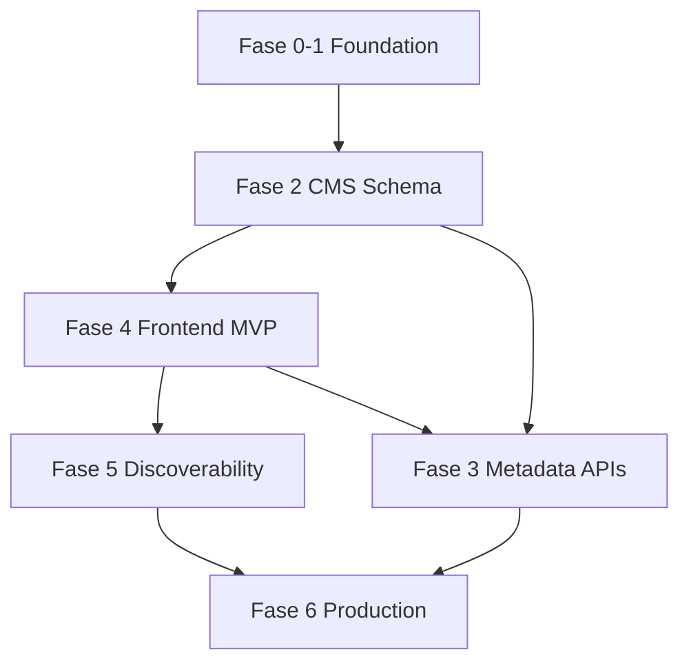

# Overview implementazione — EdArEview

Diagramma delle fasi, dipendenze e deliverable.

## Timeline

> Fase 3 può sovrapporsi parzialmente a Fase 5 se due persone lavorano in parallelo; in solitaria: 4 → 3 → 5 → 6.

## Dipendenze

## Deliverable per fase

| Fase | Deliverable chiave | URL / artefatto |
|------|-------------------|-----------------|
| 0–1 | App deployata, admin vuoto | `*.vercel.app/admin` |
| 2 | Modello dati, contenuto manuale | Neon DB popolato |
| 4 | Sito pubblico navigabile | `/`, `/anime/...` |
| 3 | Import da AniList/TMDB/IGDB | Field admin search |
| 5 | Filtri, OG, sitemap | `/sitemap.xml`, share preview |
| 6 | Dominio custom live | `edareview.*` |

## Percorsi

### Path A — MVP veloce (senza import API)

`0-1 → 2 → 4 → 6` — ~5 giorni part-time

### Path B — Completo

`0-1 → 2 → 4 → 3 → 5 → 6` — ~8-10 giorni part-time

### Path C — Solo admin personale (no sito pubblico)

`0-1 → 2 → 3` — catalogo privato via Payload; utile se il frontend può attendere.

## Metriche di successo MVP

| Metrica | Target |
|---------|--------|
| Tempo inserimento recensione | < 5 min con import API |
| Tempo inserimento manuale | < 10 min |
| Pagine indicizzabili | Homepage + listing + dettagli |
| Uptime | Vercel + Neon free tier |
| Costo mensile | €0 (escluso dominio) |

## Riferimenti

- [README piani](README.md)
- [ROADMAP](../ROADMAP.md)
- [AGENT-PLAYBOOK](../AGENT-PLAYBOOK.md)
